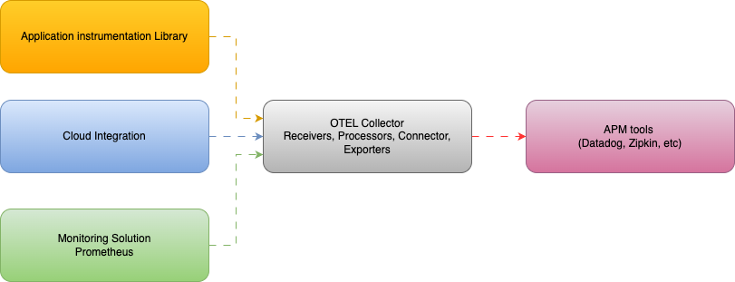
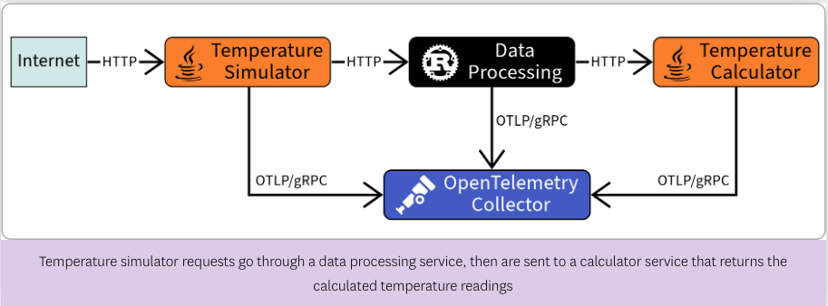

## OpenTelemetry

 - It is an open standard for collecting and exporting telemetry data.
 - It is an open-source project that provides a set of tools, APIs, and SDKs for observability—specifically for collecting and exporting metrics, logs, and traces from applications.
 - OpenTelemetry  is a [CNCF](https://cncf.io/)  incubating project, as of August 26, 2021.

## Why use OpenTelemetry

 - Moving between observability vendors can be a massive migration project
 - Being locked into a vendor can prevent you from searching for a better solution.
 - [OpenTelemetry (OTel)](https://opentelemetry.io/) simplifies choosing  or switching between vendors by separating data collection from
   backend processing.
   
## OpenTelemetry  Instrumentation
 - Instrumentation libraries
 - SDKs and APIs

## Collecting data with OpenTelemetry

 - The OTel Collector receives telemetry data from your instrumented
   application.
 - It processes and exports the telemetry data to a backend system such as Datadog, Zipkin, Elasticsearch, and many more through exporters
 - The OTel Collector consists of several components that form a
   pipeline:
	 - Receivers: collect telemetry data from various sources, such as agents, instrumentation libraries, and other collectors.
	 - Processors: transform, filter, and enrich telemetry data. They can add attributes, remove sensitive data, or aggregate data.
	 - Exporters:send telemetry data to backend systems such as Datadog, Prometheus, or Jaeger.
	 - Connectors: let a pipeline send its telemetry to another. For example, the traces pipeline can use a 		connector to send data to the metrics pipeline.

## Temperature simulator
Temperature simulator is microservice-based distributed system designed to generate simulated data for testing, analysis, or educational purposes. (Credit to Datadog )

The application consists of three services:
-   Temperature Simulator: Receives requests for readings
-   Data Processing: Simulates processing data by sleeping
-   Temperature Calculator: Simulates performing calculations then returns reading values

The application is already instrumented with OTel.

The Temperature Simulator and Calculator services use the  [zero-code/auto instrumentation](https://opentelemetry.io/docs/concepts/instrumentation/zero-code/)  to provide telemetry data for the libraries being used such as those for HTTP requests and responses.

The Data Processing service is written in Rust, which doesn’t has zero-code instrumentation, it is instrumented manually using  `actix-web-opentelemetry`  package.

## Semantic Versioning

This repository uses [GitVersion](https://gitversion.net/) to automatically generate semantic versions based on Git history and commit conventions.

### How it works

- Every push to the `main` branch triggers the semantic versioning workflow
- GitVersion analyzes the Git history and generates a semantic version (e.g., `1.2.3`)
- The workflow automatically creates and pushes a Git tag with the version number
- Version numbers follow the [Semantic Versioning 2.0.0](https://semver.org/) specification

### Configuration

The versioning behavior is configured in `GitVersion.yml`:
- **Main branch**: Uses ContinuousDelivery mode with Patch increment
- **Feature branches**: Inherit version increment with branch name tag
- **Pull requests**: Tagged with PullRequest label

### Version outputs

The workflow provides multiple version formats:
- `SemVer`: Standard semantic version (e.g., `1.2.3`)
- `FullSemVer`: Full semantic version with pre-release and metadata
- `MajorMinorPatch`: Just the version numbers
- And many other formats for different use cases

Check the workflow run logs to see all available version outputs.
